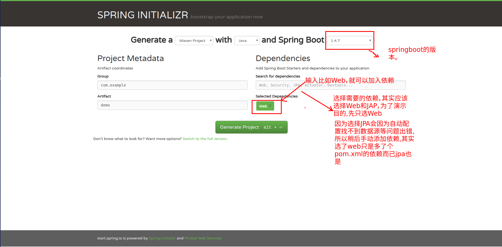
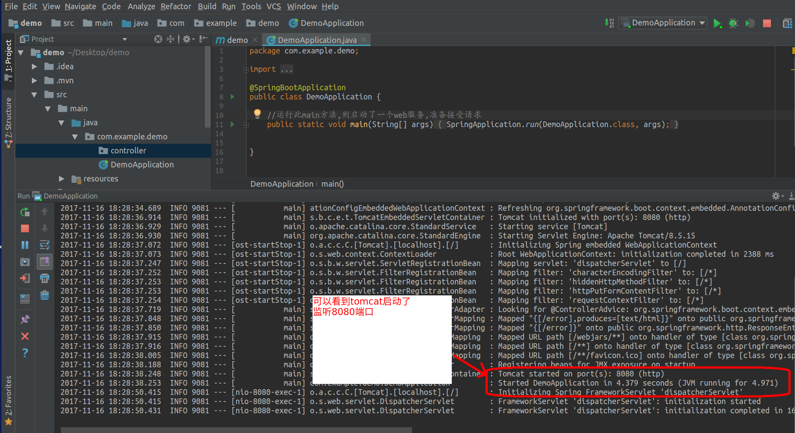
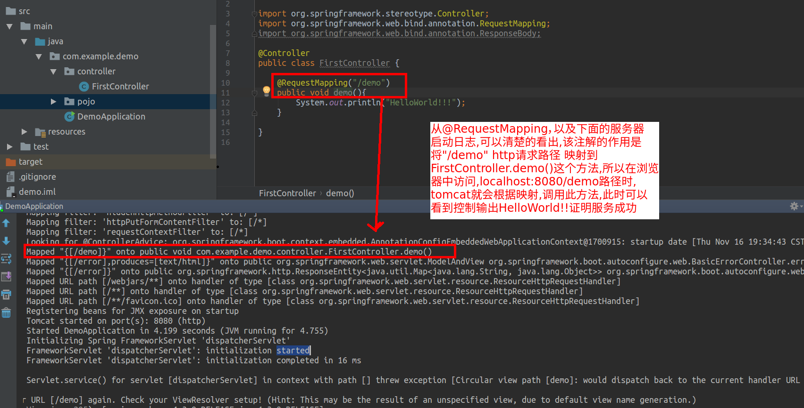
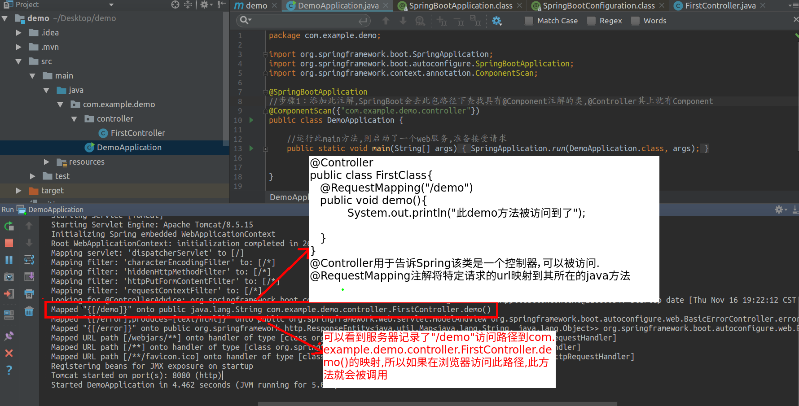
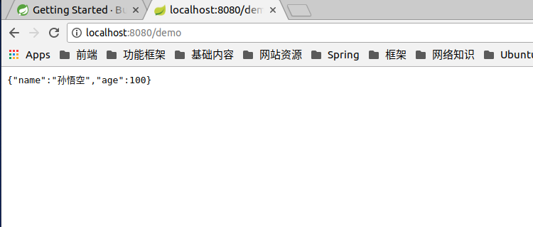
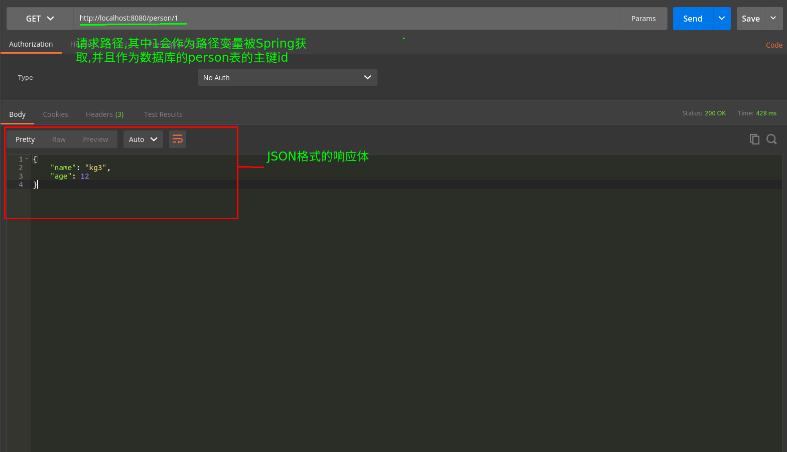
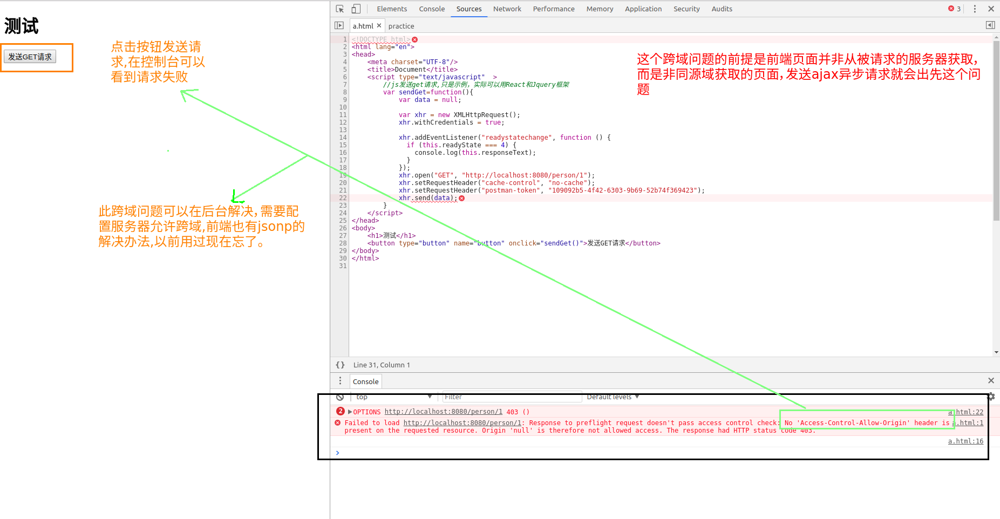
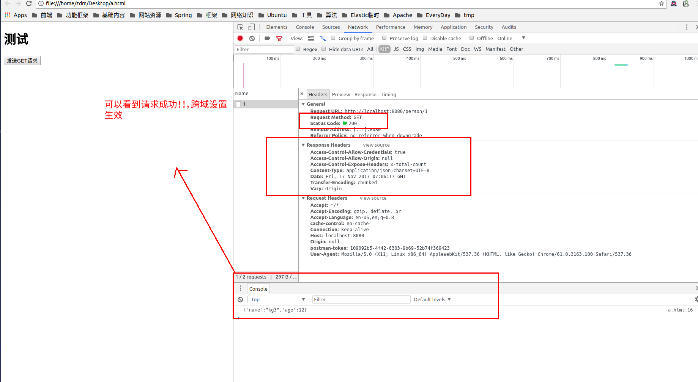

#Labrador SpringBoot 项目基本入门

####
[1.百度搜索Spring官网](https://spring.io/)
进入官网右上角点击DOCS,点击绿色按钮Start a new Spring project
进入如下页面,选择需要的依赖(这里加入的Web和JPA),这里只选择Web即可,点击绿色生成按钮Generate Project(图1)
	图1

pom.xml文件配置可以看到如下依赖

	<dependencies>
		//这个是spring,web的依赖
		<dependency>
			<groupId>org.springframework.boot</groupId>
			<artifactId>spring-boot-starter-web</artifactId>
		</dependency>
		//测试的依赖
		<dependency>
			<groupId>org.springframework.boot</groupId>
			<artifactId>spring-boot-starter-test</artifactId>
			<scope>test</scope>
		</dependency>
	</dependencies>

该项目已经有了web依赖和test依赖,可以进行基本的开发了<br>

接着分别简单写一下labrador项目用到的框架
Spring框架的作用是提供各种设计模式的支持，简化企业开发,解决一些面向对象开发的一些问题,利用DI依赖注入帮助面向接口编程的实现，并且支持AOP面向切面编程

**Web层基本配置**
图2<br>
如上图2所示,点击main方法即可运行SpringBoot应用，运行main方法会直接启动一个Tomcat服务，并且默认监听8080端口接受http请求,此时需要编写一个Controller，即在SpringMVC框架下的Web方法入口.<br>
完成此功能需要里两步<br>

1.编写一个Java类，在其上添加@Controller注解，并且编写一个映射方法

2.编写完Controller，还需要让Spring容器可以发现它,所以在配置类上添加@ComponentScan({"xx.x.x"})注解,目的是告诉Spring去哪些包下扫描组件

<br>
以下废话可忽略：
完成上俩步之后,访问浏览器localhost:8080/demo,可以在服务器控制台看到输出HelloWorld!!!，即对/demo路径的请求确实触发了demo方法,但是在浏览器会看到Whitelabel Error Page，这是因为在传统的项目中，调用controller中的方法往往是想要得到一个数据模型,并且在方法结束处会返回一个String字符串,代表一个视图路径（如jsp页面）,然后SpringBoot会利用模板技术,使用得到的模型数据对视图进行渲染,然后返回前端页面........但是我们的应用是Restful的，所以直接可以Service层处理过的数据，以JSON的形式返回给前端页面，即可达到避免RPC的使用，让服务器的功能可以被Web浏览器，或者手机客户端，安卓应用等等服务所重用（传统的web开发就是由于直接在服务器端对数据进行了渲染，然后直接返回渲染后的html，导致该应用和特定的视图耦合，导致该功能无法被一个android app重用，因为数据被视图污染了）<br>

浏览器提示错误,这是因为服务器按照默认解析,自动寻找“demo视图”而没有找到,因为我们的Rest应用,所以很少需要视图技术（除了去发送邮件等）,所以这里进行第三步：设置@ResponseBody注解，返回一个JSON格式的数据



到此Web层的最基本功能就可以用了（其他的@RequestBody以及跨域配置,以及异常处理器之后再看）

**持久层搭建**

Web层基本解决,除了跨域问题和一些请求细节的问题
现在解决持久层的问题，首先对持久层进行配置<br>
一.对持久层进行必要的配置
导入mysql-jdbc驱动,以及JPA的依赖<br>
[此链接包括了JavaConfig方式和传统的xml方式以及SpringBoot方式,labrador项目用的是那个xml方式的配置以及利用SpringBoot的自动配置](http://www.baeldung.com/the-persistence-layer-with-spring-and-jpa)<br>
由于持久层是最重要的,所以这里关闭自动配置，并且采用JavaConfig方式进行手动配置
1.在pom.xml中导入maven依赖

		<dependency>
			<groupId>mysql</groupId>
			<artifactId>mysql-connector-java</artifactId>
			<version>5.1.44</version>
			<scope>runtime</scope>
		</dependency>

		<dependency>
			<groupId>org.springframework.boot</groupId>
			<artifactId>spring-boot-starter-data-jpa</artifactId>
		</dependency>
2.进行持久层的必要配置<br>
①按照上方蓝色链接,进行JPA的必要配置,包括数据源，实体管理器的工厂，平台事务管理器等
```
@Configuration
@EnableTransactionManagement
public class PersistenceJPAConfig {

    //1.mysql基本配置以及数据源(这个数据源需要改个好点的DBCP或者C3P0或者阿里的)
    //这里的需要记得先去mysql创建好数据库,表就不需要创建,Hibernate自己会创建
    @Bean
    public DataSource dataSource(){
        DriverManagerDataSource dataSource = new DriverManagerDataSource();
        dataSource.setDriverClassName("com.mysql.jdbc.Driver");
        dataSource.setUrl("jdbc:mysql://localhost:3306/demodb");
        dataSource.setUsername("root");
        dataSource.setPassword("root");
        return dataSource;
    }

    //2.配置hibernate的一些属性
    @Bean
    public Properties additionalProperties(){
        Properties properties = new Properties();
        //开发用update,生产用validate,测试用create-drop
        properties.setProperty("hibernate.hbm2ddl.auto","update");
        properties.setProperty("hibernate.dialect", "org.hibernate.dialect.MySQL5Dialect");
        //mysql 5.5版本之后默认存储引擎是innodb,但是hibernate默认还是会生成MyISAM的存储引擎建表
        //绝大多数现在都用innodb,因为MyISAM不支持事务,而且其他各种差别也很大.这里需要显示配置存储引擎覆盖Hibernate的自动配置
        properties.setProperty("hibernate.dialect.storage_engine","innodb");
        //在控制台打印hibernate会生成的sql语句
        properties.setProperty("hibernate.show_sql","true");
        return properties;
    }

    //3.配置EntityManageFactory,实体管理器工厂
    @Bean
    public LocalContainerEntityManagerFactoryBean entityManagerFactory(){
        LocalContainerEntityManagerFactoryBean emFactory = new LocalContainerEntityManagerFactoryBean();
        //设置数据源
        emFactory.setDataSource(dataSource());
        //实体管理器需要管理实体对象,类似Spring容器管理factoryBean一样,所以需要配置扫描路径,
        //这里需要区分扫描到的@Entity是由Hibernate管理,而不是Spring
        emFactory.setPackagesToScan(new String[]{"com.example.demo.domain"});

        JpaVendorAdapter vendorAdapter = new HibernateJpaVendorAdapter();
        emFactory.setJpaVendorAdapter(vendorAdapter);
        emFactory.setJpaProperties(additionalProperties());
        return emFactory;
    }

    //4.配置平台事务管理器,最后上面的配置都被包装好,Spring和PlatformTransactionManager进行交流
    @Bean
    public PlatformTransactionManager transactionManager(EntityManagerFactory entityManagerFactory){
        JpaTransactionManager transactionManager = new JpaTransactionManager();
        transactionManager.setEntityManagerFactory(entityManagerFactory);
        return transactionManager;
    }
}
```
②将该配置类,引入主配置类(@SpringBootApplication注解其上包括@Configuration),并且添加扫描service和dao
<br>
添加
@EnableAutoConfiguration(exclude = {HibernateJpaAutoConfiguration.class})注解,可以关闭SpringBoot对JPA的自动配置
<br>
接着编写Dao和Service,Controller即可
```
//Dao实现类
@Repository
public class PersonDaoImpl implements PersonDao{
    //会在此注入一个和线程绑定的被事务管理器管理的实体管理器
    //EntityManager是JAP对Hibernate Session的包装,Session中包装了Connection的实例
    @PersistenceContext
    private EntityManager em;

    @Override
    public Person find(Serializable id) {
        return em.find(Person.class,id);
    }
}
//Service实现类
@Service
public class PersonServiceImpl implements PersonService{
	//注入PersonDao的实现类
    @Autowired
    private PersonDao personDao;

    @Transactional
    @Override
    public Person findPersonById(Integer id) {
        return personDao.find(id);
    }

}

//Controller
//注入PersonService的实现类
	@Autowired
	private PersonService personService;
	//{}中为路径变量,:后面为路径变量需要符合的正则表达式,@PathVariable中的值为前端传递过来的请求参数的名字
	@GetMapping("/person/{personId:\\d+}")
    @ResponseBody
    public Person getPersonById(@PathVariable("personId") Integer id){
        return personService.findPersonById(id);
	}

//实体类,注意需要在Hibernate配置中，扫描实体类所在包路径
//emFactory.setPackagesToScan(new       String[]{"com.example.demo.domain"});
@Entity
@Table(name="person")
public class Person {
    @Id
    //配置mysql对主键自增
    @GeneratedValue(strategy = GenerationType.IDENTITY)
    private Integer id;
    @Column(name = "name",nullable = false,length = 32)
    private String name;
    private Integer age;
	//Constructor And Getter Setter Method
}
```
运行程序之前,需要到mysql create database demodb；创建一个数据库
然后启动SpringBoot应用,Hibernate会发送DDL建立和实体类所映射的person表
我们还需要手动insert into person values (null,12,'kg3');添加一条测试记录
到此即可运行,在前端用PostMan工具模拟get请求

到此为止，框架搭建基本完成，除了一些细节，包括跨域问题,因为此项目使用使用Rest架构,返回为JSON，所以需要由前端渲染返回的JSON体，本项目用的前端是ES6+React+Redux，以及Webpack,node.js ...主要问题在于前段html页面可能运行在其他服务器，非本服务器，尤其是开发时，html运行于node.js上,所以 会有浏览器跨域的限制.接下来是跨域限制的截图，以及解决办法（只需要简单配置）<br>

//新增配置类,需要extends WebMvcConfigurerAdapter
```
@Configuration
public class DemoApplicationConfig extends WebMvcConfigurerAdapter {
    @Override
    public void addCorsMappings(CorsRegistry registry) {
        registry.addMapping("/**")
                .allowedOrigins("*",null)
                .allowedMethods("POST", "GET", "PUT", "OPTIONS", "DELETE")
                .allowCredentials(true)
                //这里是暴露可以被前端获取的响应头,如果没有这个设置,则响应头无法被js使用
                .exposedHeaders("x-total-count")
                .maxAge(3600);
    }
}
```

可以看到请求成功,解决了跨域问题。到这里项目中的框架大致搭建完毕,其他依赖需要的时候再导入即可
----
基本入门以上内容即可,剩余详细功能和注解遇到了百度把,简单说一下ElasticSearch在Spring中的搭建

>- [中文权威参考链接(版本稍微旧一点)](https://www.elastic.co/guide/cn/elasticsearch/guide/current/getting-started.html)
>- [5.6.1版本的英文文档，请求参数以及映射配置详细应该参考这个文档](https://www.elastic.co/guide/en/elasticsearch/reference/current/getting-started.html)
>- [java的客户端文档(咱们用的是lowlevel，所以不需要学额外的api，只要看es的内容并且拼接需要的json即可)](https://www.elastic.co/guide/en/elasticsearch/client/java-rest/current/java-rest-low.html)
>- [jackson的学习链接(jackson用于构建json体的,是评价最好,而且spring框架选择的json工具包)](https://www.tutorialspoint.com/jackson/jackson_quick_guide.htm)<br>

接下来在项目中进行ES客户端的配置(有点类似JDBC获取connection,获取redis获取jedis)

**ElasticSearch的配置以及使用**
1.添加es客户端的依赖
```
<dependency>
    <groupId>org.elasticsearch.client</groupId>
    <artifactId>elasticsearch-rest-client</artifactId>
    <version>5.6.1</version>
</dependency>
```
2.在Spring中配置该客户端单例(线程安全)
```
	//ElasticSearch的核心对象,线程安全
    //官网对象说明：https://www.elastic.co/guide/en/elasticsearch/client/java-rest/current/java-rest-low-usage-initialization.html
    @Bean
    public RestClient restClient(){
        HttpHost httpHost = new HttpHost("localhost", 9200, "http");
        return RestClient.builder(httpHost).build();
    }
```
3.获取客户端，发送请求即可
[官方文档参考链接](https://www.elastic.co/guide/en/elasticsearch/client/java-rest/5.6/java-rest-low-usage-requests.html)

```
@Configuration
public class DemoApplicationConfig extends WebMvcConfigurerAdapter {
    @Override
    public void addCorsMappings(CorsRegistry registry) {
        registry.addMapping("/**")
                .allowedOrigins("*",null)
                .allowedMethods("POST", "GET", "PUT", "OPTIONS", "DELETE")
                .allowCredentials(true)
                //这里是暴露可以被前端获取的响应头,如果没有这个设置,则响应头无法被js使用
                .exposedHeaders("x-total-count")
                .maxAge(3600);
    }


    //ElasticSearch的核心对象,线程安全
    //官网对象说明：https://www.elastic.co/guide/en/elasticsearch/client/java-rest/current/java-rest-low-usage-initialization.html
    @Bean
    public RestClient restClient(){
        HttpHost httpHost = new HttpHost("localhost", 9200, "http");
        return RestClient.builder(httpHost).build();
    }
}
```
测试代码
```
@SpringBootTest(classes = DemoApplication.class)
@RunWith(SpringRunner.class)
public class ElasticClientDemo {

    @Resource
    private RestClient restClient;

    @Test
    public void request() throws Exception{
        //reference https://www.elastic.co/guide/en/elasticsearch/client/java-rest/5.6/java-rest-low-usage-requests.html
        Map<String, String> params = Collections.emptyMap();
        Response reponse = restClient.performRequest("GET", "/", params);
        InputStream content = reponse.getEntity().getContent();
        ObjectMapper mapper = new ObjectMapper();
        //jackson文档用google搜,百度出来的都比较旧,要么是json-lib,要么是阿里的fastjson
        JsonNode rootNode = mapper.readTree(content);
        System.out.println(rootNode);

    }
}
```
